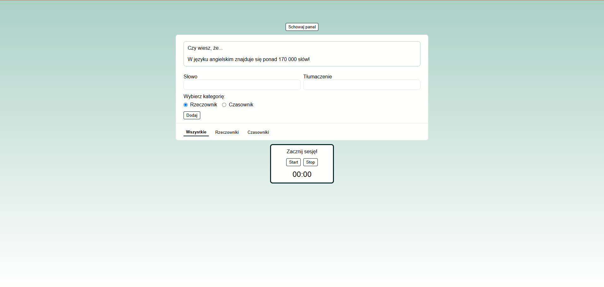

# Flash card app

Flash card app in react with simple json server. The application makes it easy to remember words and learn it. 
## Demo

There is currently no demo version of the application. If you want to use it, you must run it locally. A demo version will be available in the future.


## Run Locally

Clone the project

```bash
  git clone https://github.com/Szafter12/Flash-cards-app.git
```

Go to the project directory

```bash
  cd Flash-cards-app
```

Install dependencies

```bash
  npm install
```

Start the server

```bash
  npm run dev
```


## Screenshots




## Features

- You can add words and their translation
- You can group words in the 2 category (nouns and verbs)
- Words are saved in the database so that once you add them, they do not disappear until you delete them
- Counting down the session time 


## Tech Stack

- React
- JSON server
- Vite


## Authors

- [@Jakub Pachut](https://github.com/Szafter12)

